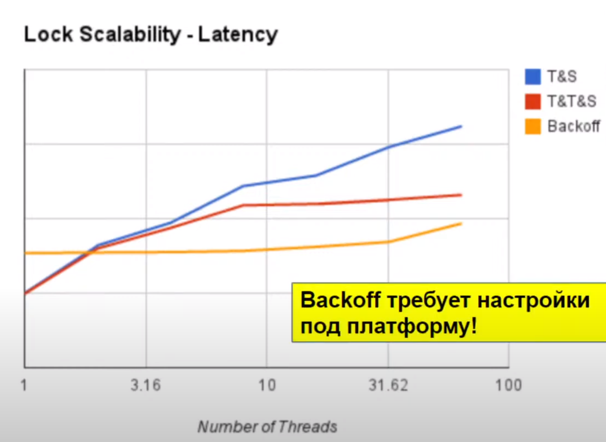

# Лекция 10. Железо и спинлоки

У ядер есть кеш. Это проблема, ибо если одно ядро записало в свой кеш, а другое ядро прочитало старое закешированное значение, то мы проиграли. У современных процессоров кеш когерентен, поэтому таких проблем нет. Это реализовано через протокол когерентности, одним из таких является MESI (в реальных процессорах чуть сложнее).

У каждого кешлайна в кеше есть статус:
- Modified
- Exclusive
- Shared
- Invalid

Изначально статус I, при получении данных из памяти получается E (только в одном кеше). Если другое ядро читает E-кешлайн первого ядра, то на запрос отвечает кеш первого ядра и в обоих кешах эта линия становится S. При изменении значения статус становится M, а в остальных кешах линия инвалидируется.

Если состояние IM, то первое ядро прочитает из кеша второго и опять станет SS. В память мы пишем при flush из кеша.

Простейший Test-And-Set lock:
```python
class TASLock:
    boolean locked
    
    def lock():
        # сбрасывает все кеши, т.к. требует Exclusive и забивает шину
        while locked.getAndSet(true):
            pass
    
    def unlock():
        locked = false
```

Применим double-checked locking - добавим `while locked: pass`. Таким образом, ожидание не создает трафик. Но в момент `unlock` все ядра пытаются захватить лок и опять кушают ресурсы. Добавим задержку (backoff) в цикл в `lock`. Тогда не все будут ломиться одновремнно и пока задержка пройдет, возможно другой поток уже возьмет лок, тогда мы не будем пытаться его брать.



### CLH Lock

Этот лок first-come first-served.

```python
# padнуто до размера кешлинии
class QNode:
    boolean locked # shared, atomic

class CLHLock:
    tail = QNode() # shared, atomic
    threadlocal my = QNode()
    
    def lock():
        my.locked = True
        pred = tail.getAndSet(my)
        while pred.locked: pass

    def unlock():
        my.locked = False
        my = pred
```

Получается неявная очередь, где каждый ждет предыдущий поток. Теперь при `unlock` только один поток побежит в шину.

В NUMA системах это не очень хорошо работает, потому что мы ждём на памяти предыдущего процессора.

### MCS

Тоже FCFS, но ждёт на своей памяти. В ноду добавляем указатель на следующую вершину.

```python
class CLHLock:
    tail = QNode() # shared, atomic
    threadlocal my = null
    
    def lock():
        my = QNode() # alloc in my memory!
        my.locked = True
        pred = tail.getAndSet(my)
        if pred != null:
            pred.next = my
            while my.locked: pass
    
    def unlock():
        if my.next == null:
            if tail.CAS(my, null): # мы хвост, действительно никого больше нет
                return
            else: # мы не хвост, просто кто-то не успел выставить
                while my.next == null:  # ждем пока не проставят
                    pass
        my.next.locked = False
```

И у MCS и у CHL есть одна проблема: tail меняется всеми потоками и это большая конкуренция. Она неисправима, если мы хотим FCFS lock, то нам нужно синхронизироваться насчет порядка. При очень большом числе ядер это слишком проблематично, проще отказаться от FCFS.

### Lock cohorting

Ядра на одном узле (с общей памятью) делят свой обычный лок. Есть также глобальный лок, который мы ждем после локального. В глобальный лок стучится максимум столько потоков, сколько и узлов, а их обычно немного.

- Глобальный лок: **Thread-Oblivious**
  - Его брать и освобождать могут любые потоки
  - Пример: Backoff
- Локальный лок: **Cohort Dtection**
  - Должен уметь понимать, есть ли другие локи, которые его ждут.
  - Пример: MCS
